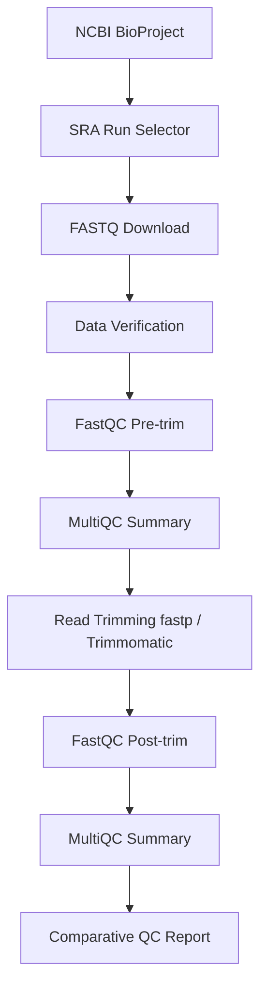

# [🧬 Bacterial Genomics Capstone Project](https://github.com/THEKINGSTAR/capstone_Bactiral_Genomics.git)

## Whole Genome Sequencing (WGS) Quality Control Pipeline

---

## 📖 Project Overview

This repository contains a complete **Whole Genome Sequencing (WGS) Quality Control (QC)** workflow developed as the capstone project for the **Bacterial Genomics** course.

The project demonstrates a reproducible bioinformatics pipeline beginning with public sequencing data retrieval from the **NCBI Sequence Read Archive (SRA)** and ending with post-trimming quality assessment using **FastQC** and **MultiQC**.

The workflow follows standard bioinformatics practices for processing paired-end Illumina sequencing data and emphasizes reproducibility, quality assessment, and interpretation of sequencing quality before and after read trimming.

---

# 🎯 Learning Objectives

By completing this project, participants will be able to:

* Navigate the `NCBI` databases to locate a `BioProject` and its associated `SRA` runs.
* Retrieve sequencing data using the `SRA` `Toolkit`.
* Organize a reproducible bioinformatics project structure.
* Determine expected genome characteristics (genome size and `GC` content).
* Evaluate `raw` sequencing quality using `FastQC`.
* Aggregate `QC` reports using `MultiQC`.
* Perform adapter and quality trimming using `fastp` or `Trimmomatic`.
* Compare sequencing quality before and after trimming.
* Produce a concise quality-control report suitable for scientific documentation.

---

# 📂 Dataset Information

| Item                    | Value                            |
| ----------------------- | -------------------------------- |
| **BioProject**          | PRJNA1478106                     |
| **Organism**            | *Pseudomonas* isolates           |
| **Sequencing Platform** | Illumina                         |
| **Read Type**           | Paired-End                       |
| **Number of Samples**   | 10 SRA Runs                      |
| **Source Database**     | NCBI Sequence Read Archive (SRA) |

---

# 🔬 Project Workflow

---

# 📁 Project Structure

    capstone_Bactiral_Genomics/
    │
    ├── raw_data/
    │
    ├── trimmed_reads/
    │
    ├── fastqc_results/
    │
    ├── multiqc_results/
    │
    ├── scripts/
    │
    ├── logs/
    │
    ├── results/
    │
    ├── docs/
    │
    ├── post_trim_multiqc_report.html
    │
    └── README.md

---

# 🛠 Software Used

| **Software**      | **Purpose**                   |
| -----------   | ------------------------- |
| `SRA Toolkit `| Download sequencing data  |
| `FastQC`      | Read quality assessment   |
| `MultiQC`     | Aggregate QC reports      |
| `fastp`       | Read trimming             |
| `Trimmomatic` | Alternative trimming tool |
| `Bash`        | Workflow automation       |
| `Linux`       | Analysis environment      |

---

# 📊 Quality Control Workflow

## Pre-Trimming

Quality assessment was first performed on the raw sequencing reads using **FastQC**.

The generated reports were aggregated with **MultiQC** to evaluate:

* Per Base Sequence Quality
* Per Sequence Quality Scores
* Adapter Content
* Sequence Duplication Levels
* GC Content
* Overrepresented Sequences
* Sequence Length Distribution

---

## Read Trimming

Reads were trimmed using either:

* **fastp** (automatic adapter detection)

or

* **Trimmomatic**

Typical trimming parameters include:

    ILLUMINACLIP
    SLIDINGWINDOW:4:20
    LEADING:3
    TRAILING:3
    MINLEN:36

---

## Post-Trimming

Following trimming, FastQC and MultiQC were executed again to evaluate improvements in sequencing quality and confirm the successful removal of adapters and low-quality bases.

---

# 📈 Interactive Reports

## 📄 Pre-Trimming MultiQC Report

➡ **Open the interactive reports here:**

- [Pre-Trim MultiQC](https://thekingstar.github.io/capstone_Bactiral_Genomics/multiqc_results/post_trim_multiqc_report.html)

## 📄 Post-Trimming MultiQC Report

➡ **Open the interactive reports here:**

- [Post-Trim MultiQC](https://thekingstar.github.io/capstone_Bactiral_Genomics/multiqc_results/post_trim_multiqc_report.html)

---

# ✅ Quality Assessment Checklist

* [x] BioProject identified
* [x] SRA runs retrieved
* [x] Project directory organized
* [x] Genome metadata collected
* [x] Raw FASTQ files verified
* [x] Pre-trim FastQC completed
* [x] Pre-trim MultiQC completed
* [x] Adapter trimming performed
* [x] Post-trim FastQC completed
* [x] Post-trim MultiQC completed
* [x] Comparative QC report prepared

---

# 📚 Capstone Objectives

The project includes the complete workflow required for the capstone assessment:

1. Navigate `NCBI` to locate `BioProject` **`PRJNA1478106`**.
2. Retrieve all associated paired-end sequencing runs.
3. Organize a reproducible project directory.
4. Obtain genome size and `GC-content` metadata.
5. Assess sequencing quality before trimming.
6. Trim adapters and low-quality bases.
7. Reassess sequencing quality after trimming.
8. Compare `pre-` and `post-` `trimming` quality metrics.
9. Produce a concise `quality-control` report.
10. Submit the required deliverables.

---

# 🤝 Acknowledgments & Workshop Context

This capstone project was developed as part of specialized bioinformatics training conducted by **[CSIR-ARI](https://www.csir.org.gh/)** in collaboration with **[Omics Hub](https://omicshub.org/)**, and generously supported by **[The Company of Biologists](https://www.biologists.com/)**.

---

# 🚀 Reproducibility

This repository is organized to ensure that the complete workflow can be reproduced on any Linux system with the required software installed.

Each analysis step is documented, and all scripts can be executed independently to regenerate the results from the original sequencing data.

---

# 📖 References

* `NCBI` Sequence Read Archive (`SRA`)
* `NCBI` `BioProject` Database
* `FastQC` Documentation
* `MultiQC` Documentation
* `fastp` Documentation
* `Trimmomatic` Documentation

---

# 👨‍💻 Author

**Khaled Mohamed Fathallah**

Bioinformatics Researcher | Data Scientist | Data Engineer | Software Engineer

---

# 📜 License

[MIT](https://opensource.org/license/mit) License : This repository is intended for educational and research purposes.

If you use this workflow as a reference, please consider citing the original software packages used throughout the analysis.